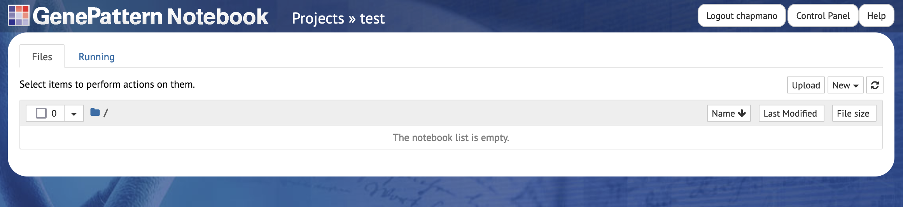

# Analysis of methylation data with minfi and conumee

<!---->

## 0. Dependencies
- [R](https://www.r-project.org/)
- [minfi](https://bioconductor.org/packages/devel/bioc/vignettes/minfi/inst/doc/minfi.html)
- [conumee](https://bioconductor.org/packages/devel/bioc/vignettes/conumee/inst/doc/conumee.html)
- [jupyter lab](https://jupyter.org/try-jupyter/lab/?path=notebooks%2FIntro.ipynb)

## 1. Walkthrough
### 1.0. Get started in GenePattern Notebook
GenePattern Notebook (GPN) is a cloud bioinformatics resource developed and maintained by the Mesirov lab at UCSD. It is designed for use by computational experts and newbies alike, and provides compute resources, a standard Linux operating system (OS), the programming languages `python` and `R`, the version control software `git`, and the interactive software development tool `jupyter notebook`. All of the steps in this walkthrough should equally work on your local Linux, Windows, or Mac OS with all of the above softwares (although we've only minimally tested this) [^1].
- Navigate to [GenePattern Notebook](https://notebook.genepattern.org/) and create an account.
- Create a new project "methylation-analysis-demo". This will open a new tab with the GPN user interface (UI), and would be equivalent to opening a terminal and running `jupyter notebook` on a fresh Linux box with `python`, `R`, `git`, and `jupyter` installed.

### 1.1. Install dependencies
Most analyses use existing software written and distributed by someone else, called *packages*. Those packages in turn will require other third-party packages to run, called *dependencies*, which will in turn require more dependencies, etc. This tutorial uses the `minfi` and `conumee` packages to analyze Illumina methylation array data, but the entire *dependency tree* is about 266 different software packages, each with specific versions. We will use the `conda` *package manager*, preinstalled into your GenePattern Notebook account[^2], to install these.
- In the top right hand corner of the interface, click `New` > `Terminal`. This will open a bash command line interface (CLI), which you can use to download resources and install software.
- **Download the code.** Git is a software for maintaining and distributing other software. Run the command `git clone git@github.com:chavez-lab/methylation-analysis-tutorial.git` on the CLI to download the code for this tutorial.
- **Set up your environment.** A *virtual environment* (VE) is an isolated set of software tools for running a particular task. We will create a virtual environment for all of the software required for methylation analysis using `conda`.
- The softwares required for this tutorial are listed in the `_environment.yml` file of this repository. Run `conda env create --prefix=~/.conda/methylation --file=methylation-analysis-tutorial/_environment.yml`[^3] to create the VE and install all dependencies. **This will take awhile to run.**
- Run `conda init; source ~/.bashrc`; the reason this is necessary is beyond scope of this tutorial. Briefly, if you don't run this, then `conda` will tell you to run this before you can run the next command.
- Run `conda activate ~/.conda/methylation` to enter your new VE.
- Run `R -e 'IRkernel::installspec(name = "methylation", displayname = "methylation")'`. This will make your environment accessible within GenePattern Notebook.

\* Developer note: Dockerize this so that the environment comes pre-distributed?
### 1.2. Download data
Bioinformatics frequently requires lots of data. This tutorial will use methylation array data of 1,256 medulloblastomas.
- Download the data at [download link](https://16515-my.sharepoint.com/:u:/g/personal/laurelia_sbpdiscovery_org/ESz_vdKN4tlHuxjJysm7y4EBonw1nMSq-Ji3U10FpAGC8w?e=kP2rtz).
- In the UI, navigate to the methylation-analysis-tutorial directory and upload data.zip using the `Upload` button in the top-right corner. **This will also take a long time.** Yes, we're working on a better way to do this.
- In your Terminal tab, `cd methylation-analysis-tutorial` to navigate to the tutorial directory.
- The data are in compressed format. Unzip it: `unzip data.zip`.
- You don't need the .zip file anymore. Delete it with `rm data.zip`.
- You are now done with the Terminal and can close it.

\* Developer note: Host this somewhere with a public download link. Even better, put readonly copies somewhere on the GenePattern server so the user doesn't have to download at all.

### 1.3 Run the analysis
We now have a lot of data and the bioinformatics software tools to analyze it. 
- Open methylation-analysis-tutorial/methylation.ipynb. This is a jupyter notebook.
- You will need to change the *kernel* to use the `methylation` kernel we just installed via conda. Using the menu at the top, select `Kernel` > `Change kernel` > `methylation`.
- Read and run the code in each cell in descending order using `Shift + Enter`.

## Lab notebook
2023 course materials: https://www.dropbox.com/scl/fo/ikec8fs2xovk0onljsyd2/h?dl=0

Things I have learned so far:
- To set up your virtual environment with jupyter lab, see 
https://www.zainrizvi.io/blog/jupyter-notebooks-best-practices-use-virtual-environments/
- Lots of bioconda packages will will only build on intel cpus. If you are using conda and 
apple silicon, see 
https://stackoverflow.com/questions/71515117/how-to-set-up-a-conda-osx-64-environment-on-arm-mac
- Using conda to install R packages (minfi and conumee + dependencies) seems to exceed the 
RAM limit for [mybinder.org](mybinder.org). See 
https://discourse.jupyter.org/t/how-can-i-prevent-an-out-of-memory-error-in-github-actions/17294

[^1]: Footnotes indicate differences between setup on GPN vs. a local machine with Linux, git, conda etc. installed.
[^2]: We use conda here specifically because it is preinstalled on GPN. If running locally, the `mamba` package manager is faster with equivalent syntax.
[^3]: The `--prefix` flag is required on GPN because only the user directory is persisted between sessions. If running locally, the `--prefix` flag is not necessary.

