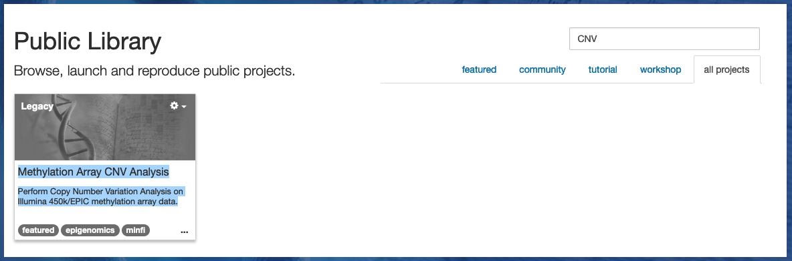
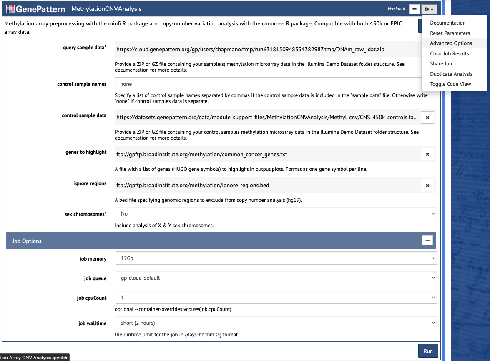

# Analysis of methylation data with minfi and conumee

<!---->

## 0. Dependencies
- [R](https://www.r-project.org/)
- [minfi](https://bioconductor.org/packages/devel/bioc/vignettes/minfi/inst/doc/minfi.html)
- [conumee](https://bioconductor.org/packages/devel/bioc/vignettes/conumee/inst/doc/conumee.html)
- [jupyter lab](https://jupyter.org/try-jupyter/lab/?path=notebooks%2FIntro.ipynb)

## 1. Walkthrough
### 1.0. Get started in GenePattern Notebook
GenePattern Notebook (GPN) is a cloud bioinformatics resource developed and maintained by the Mesirov lab at UCSD. It is designed for use by computational experts and newbies alike, and provides compute resources, a standard Linux operating system (OS), the programming languages `python` and `R`, the version control software `git`, and the interactive software development tool `jupyter notebook`. All of the steps in this walkthrough should equally work on your local Linux, Windows, or Mac OS with all of the above softwares (although we've only minimally tested this) [^1].
- Navigate to [GenePattern Notebook](https://notebook.genepattern.org/) and create an account.
- Create a new project "methylation-analysis-demo". This will open a new tab with the GPN user interface (UI), and would be equivalent to opening a terminal and running `jupyter notebook` on a fresh Linux box with `python`, `R`, `git`, and `jupyter` installed.

### 1.1. Install dependencies
Most analyses use existing software written and distributed by someone else, called *packages*. Those packages in turn will require other third-party packages to run, called *dependencies*, which will in turn require more dependencies, etc. This tutorial uses the `minfi` and `conumee` packages to analyze Illumina methylation array data, but the entire *dependency tree* is about 266 different software packages, each with specific versions. We will use the `conda` *package manager*, preinstalled into your GenePattern Notebook account[^2], to install these.
- In the top right hand corner of the interface, click `New` > `Terminal`. This will open a bash command line interface (CLI), which you can use to download resources and install software.
- **Download the code.** Git is a software for maintaining and distributing other software. Run the command `git clone https://github.com/chavez-lab/methylation-analysis-tutorial.git` on the CLI to download the code for this tutorial.
- **Set up your environment.** A *virtual environment* (VE) is an isolated set of software tools for running a particular task. We will create a virtual environment for all of the software required for methylation analysis using `conda`.
- The softwares required for this tutorial are listed in the `_environment.yml` file of this repository. Run `conda env create --prefix=~/.conda/methylation --file=methylation-analysis-tutorial/_environment.yml`[^3] to create the VE and install all dependencies. **This will take awhile to run.**
- Run `conda init; source ~/.bashrc`; the reason this is necessary is beyond scope of this tutorial. Briefly, if you don't run this, then `conda` will tell you to run this before you can run the next command.
- Run `conda activate ~/.conda/methylation` to enter your new VE.
- Run `R -e 'IRkernel::installspec(name = "methylation", displayname = "methylation")'`. This will make your environment accessible within GenePattern Notebook.

### 1.2. Upload data
Bioinformatics frequently requires lots of data. This tutorial will use methylation array data of 400 medulloblastomas. GenePattern Notebooks has an 'Upload' feature to import your own files into your home directory, but to save time we have already uploaded the medulloblastoma dataset to the GP server at https://datasets.genepattern.org/?prefix=data/chapman/. This link is included in the analysis code (see 1.3) so no action is necessary for you at this time.

### 1.3 Run the analysis
We now have a lot of data and the bioinformatics software tools to analyze it. 
- Open methylation-analysis-tutorial/methylation.ipynb. This is a *jupyter notebook*.
- You will need to change the *kernel* to use the `methylation` kernel we just installed via conda. Using the menu at the top, select `Kernel` > `Change kernel` > `methylation`.
- Read and run the code in each cell in descending order using `Shift + Enter`.

## 2. Homework
The homework consists of two parts. Section 1 included several questions 1.1-1.9 in the `methylation.ipynb` notebook. In section 2, you will infer genome-wide copy number alterations from methylation array data using the `conumee` package.

In addition to providing compute resources in a basic Linux environment, GenePattern also maintains standalone software modules to perform various common bioinformatics analyses. One such frequent use case is copy number inference from methylation array data, implemented in the MethylationCNVAnalysis module. This tutorial will use the GP Notebook at [notebook.genepattern.org](https://notebook.genepattern.org/), but may also be run using the module at [cloud.genepattern.org](https://cloud.genepattern.org/). Adventurous users will find the source code in `src/run.R` of the [MethylationCNVAnalysis](https://github.com/genepattern/MethylationCNVAnalysis/tree/f921fa141c6a3e05031b3b51f1af72a8c0774211) repo on Github.

### 2.0 Run the copy number analysis
- In the GPN Control Panel, scroll down and search 'CNV' in the search bar of the Public Library. Select the 'Methylation Array CNV Analysis' GP Notebook to open it.

- Proceed through the cells in descending order as before. When prompted to login, do so.
- The cell titled 'MethylationCNVAnalysis' is a special cell to run the eponymous GP module. Enter the url containing methylation data of 4 glioblastoma patients into the query field: https://datasets.genepattern.org/data/chapman/DNAm_raw_idat.zip. Use the urls in the Example (blue box) for the 'control sample data', 'genes to highlight', and 'ignore regions' fields. Set 'sex chromosomes' to 'no'.
- This job will require more than the default resource allocation for this module. To request additional memory allocation, click the gear menu in the upper right corner of the MethylationCNVAnalysis cell and select "Advanced Options." This will make a new "Job Options" section appear at the bottom of the module. In this section set the "job memory" parameter to 16Gb. 
- Select the 'Run' button **exactly once**. This will queue your job onto the GenePattern server, which may take around 10 minutes to complete.
- When the job completes, the cell will update with links to output files. Review the copy number plots to answer the last homework question:

**Q2.1: Which patient has a chromosome 16q loss?**

### 2.1 Submit responses
Submit responses to questions 1.1-1.9 (see methylation.ipynb) and 2.1 to **TBD**.

## Lab notebook
2024 course materials: [https://www.dropbox.com/scl/fo/ikec8fs2xovk0onljsyd2/h?dl=0](https://www.dropbox.com/scl/fo/vga2lu7bj0rwcbw3dqjvs/h?rlkey=rplszwoxsj83s34270qgpwaov&dl=0)

Things I have learned so far:
- To set up your virtual environment with jupyter lab, see 
https://www.zainrizvi.io/blog/jupyter-notebooks-best-practices-use-virtual-environments/
- Lots of bioconda packages will will only build on intel cpus. If you are using conda and 
apple silicon, see 
https://stackoverflow.com/questions/71515117/how-to-set-up-a-conda-osx-64-environment-on-arm-mac
- Using conda to install R packages (minfi and conumee + dependencies) seems to exceed the 
RAM limit for [mybinder.org](mybinder.org). See 
https://discourse.jupyter.org/t/how-can-i-prevent-an-out-of-memory-error-in-github-actions/17294

[^1]: Footnotes indicate differences between setup on GPN vs. a local machine with Linux, git, conda etc. installed.
[^2]: We use conda here specifically because it is preinstalled on GPN. If running locally, the `mamba` package manager is faster with equivalent syntax.
[^3]: The `--prefix` flag is required on GPN because only the user directory is persisted between sessions. If running locally, the `--prefix` flag is not necessary.

