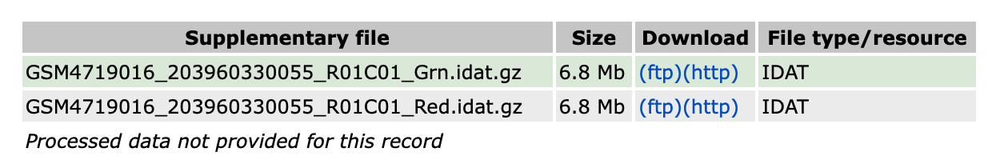

# Brain tumor classification using methylation data

## 0. Dependencies
This project is written in R using Jupyter notebooks. Methylation data is handled using the *minfi* package.
- [R](https://www.r-project.org/)
- [minfi](https://bioconductor.org/packages/devel/bioc/vignettes/minfi/inst/doc/minfi.html)
- [jupyter lab](https://jupyter.org/try-jupyter/lab/?path=notebooks%2FIntro.ipynb)
The full list of dependencies can be found in [`environment.yml`](environment.yml).

## 1. Installation
See the [installation guide](docs/install.md) to set up this tutorial on the cloud at genepattern.org or on your local computer. 

## 2. Upload data
Bioinformatics frequently requires lots of data. This tutorial will use methylation array data of 400 medulloblastomas. 
**GPN** GenePattern Notebooks has an 'Upload' feature to import your own files into your home directory, but to save time we have already uploaded the medulloblastoma dataset to the GP server at https://datasets.genepattern.org/?prefix=data/chapman/. This link is included in the analysis code (see 1.3) so no action is necessary for you at this time.  
**Local install** Download [MBlandscape_subset_400.RData](https://datasets.genepattern.org/data/chapman/MBlandscape_subset_400.RData) to the `./data/` directory of this repository.

## 3. Run the analysis
We now have a lot of data and the bioinformatics software tools to analyze it. 
- (local install only) In your CLI, navigate to this repository and run `jupyter lab` to open the notebooks interface. 
- Open methylation-analysis-tutorial/methylation.ipynb. This is a *jupyter notebook*.
- You will need to change the *kernel* to use the `methylation` environment we just installed via conda. Using the menu at the top, select `Kernel` > `Change kernel` > `methylation`.
- Read and run the code in each cell in descending order using `Shift + Enter`.

## 4. Homework
[日本語訳](docs/hw-jp.md)

In Section 3, we performed the analysis steps to cluster a small set of 400 brain tumors by their methylation profiles. Since the publication of this method in 2018[^1], those authors have assembled a large dataset of tens of thousands of solid tumors. The classifier trained on that dataset is available for research use at [https://app.epignostix.com/]. As an exercise, we will submit methylation data for an unknown tumor sample to this classifier and interpret the resulting report.

### 4.1 Instructions
- **Register an account**. Navigate to [https://app.epignostix.com/#/sign-up] and enter your information.

- Wait for your account to be approved.
- **Download the sample data**. Our data comes from GEO, a public repository of gene expression data hosted by the National Institutes of Health (NIH, USA). Datasets and samples are given searchable unique IDs. Our mystery sample is [GSM4719016](https://www.ncbi.nlm.nih.gov/geo/query/acc.cgi?acc=GSM4719016). Download both `.idat` files.

- The downloaded files are compressed in `.gz` format. Uncompress them into `.idat`.[^2]
- **Upload your sample**. In the app.epignostix.com web interface, select "Methylation" > "Upload sample". Enter the sample name, upload both idat files, and select "Heidelberg Epignostix CNS Tumor Classifier v12.8 (v0.4)". Check the box and click "Start analysis".

- **Read the report**. When your sample has finished running, it will appear in the "Methylation" > "Sample list" interface. Select it.

Click "show" to read the report.

### 4.2 Homework questions
- **4.2.1** What is the classification of this tumor?

[^1]: Capper et al., “DNA methylation-based classification of central nervous system tumors.” Nature 2018. 
[^2]: (Mac OS): Simply double-click to open and decompression will happen automatically. (Windows): Windows doesn't natively support .gz compression. Open WSL and follow Linux instructions. (Linux): `gunzip GSM4719016_203960330055_R01C01_Grn.idat.gz`.